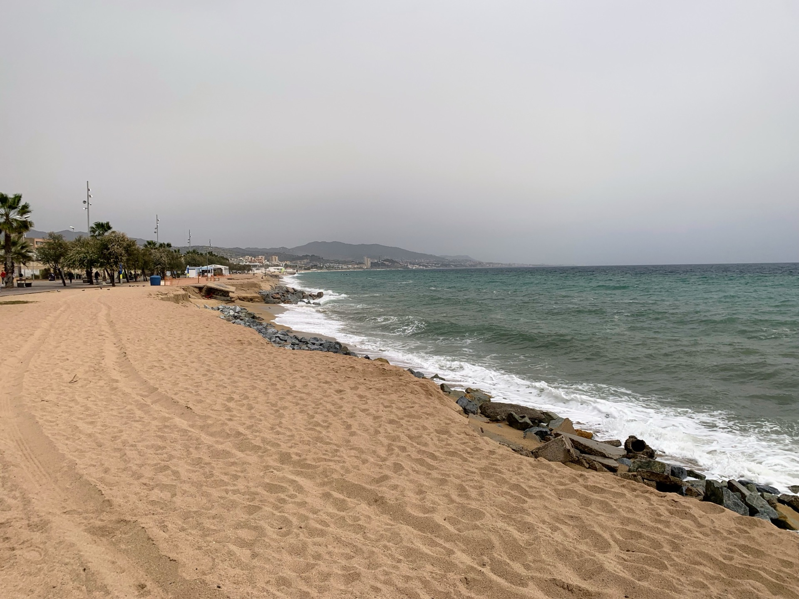
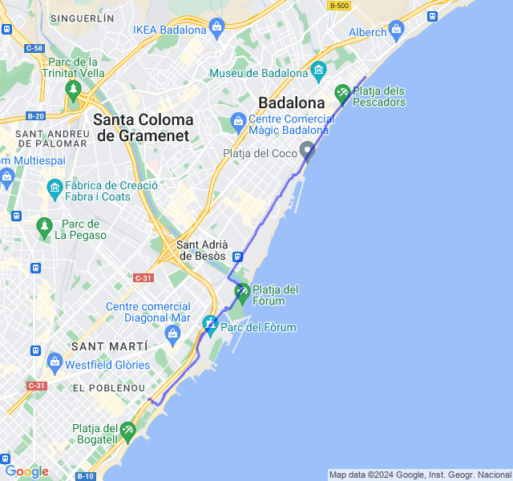
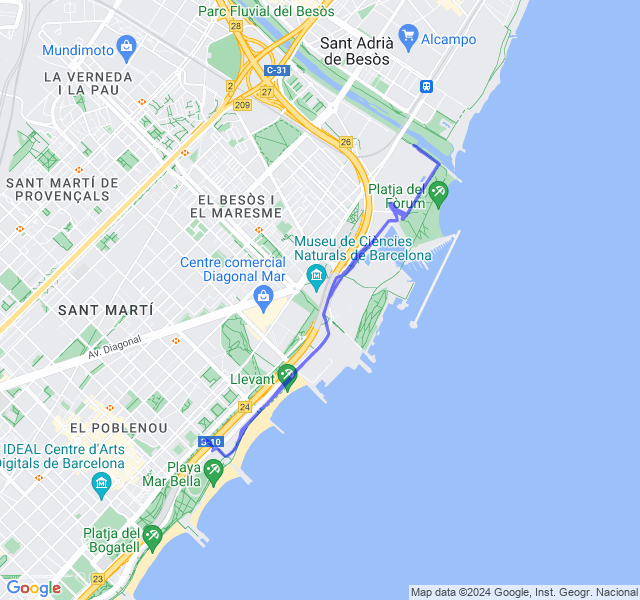
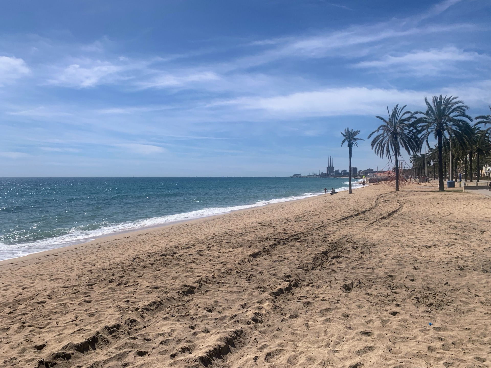
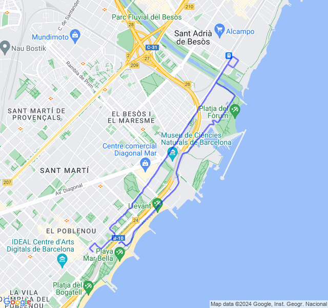
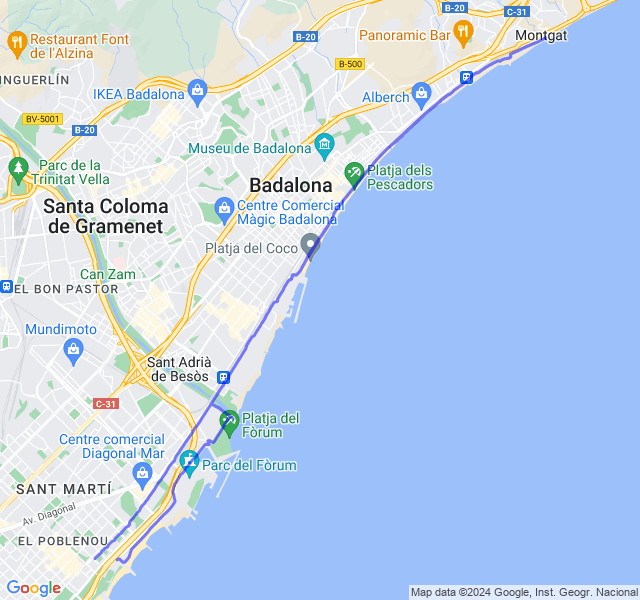
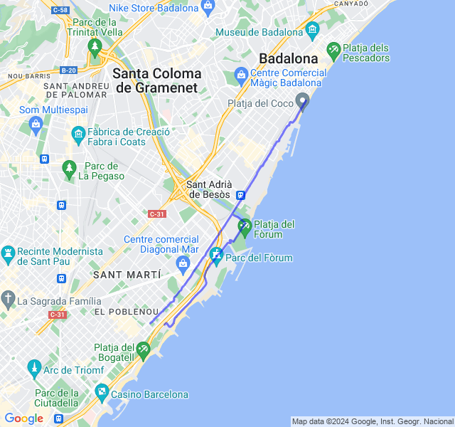

Ultima settimana piena prima dello scarico!
<!--more-->

## Prima uscita
14km Z1 + andature + allunghi.

Dopo il lungo di Sabato la settimana inizia un giorno dopo causa festa.
Tutto tranquillo, gambe ancora un po' rigide, soprattutto dopo la corsa più che durante.



## Seconda uscita
10x400 Z5 (VDOT 3:26). Eccoci con un altro bell'allenamento di quelli che piacciono al coach ☠️!
Nella prima metà avevo i quadricipiti ancora un po' pesanti dal lungo ma poi si son sciolti un po'.
Mi pare andato abbastanza bene.



## Terza uscita



## Quarta uscita
5x2000 Z3 (VDOT 4:15) rec 1000 Z2.
Come al solito i 4:15 del VDOT per la Z3 son un po' ottimisti e ho puntato da subito a stare sui 4:20 monitorando anche la FC.
Andato direi bene, FC sempre in Z3 e, a parte la seconda parte controvento, anche nei recuperi la FC scendeva bene.



## Quinta uscita
12km Z2. Allenamento di ieri scambiato con il lungo per incastri vari.
Tutto bene, dopo un paio di settimane una Z2 con un buon passo e FC al suo posto 😜


