Settimane caotiche a cavallo della London Marathon 2024, la mia prima major!

<!--more--> 

## Settimana pre gara

- 12km Z1 + andature + allunghi
Allenamento pessimo, poche energie, dormito male. Ho tagliato corto anche andature a allunghi perchè non era giornata.

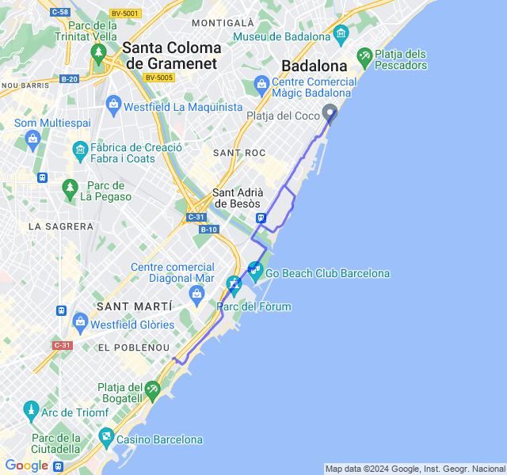



- 2x3km + 1.5km Z4.
Oggi invece allenamento bello impegnativo ma finito bene.

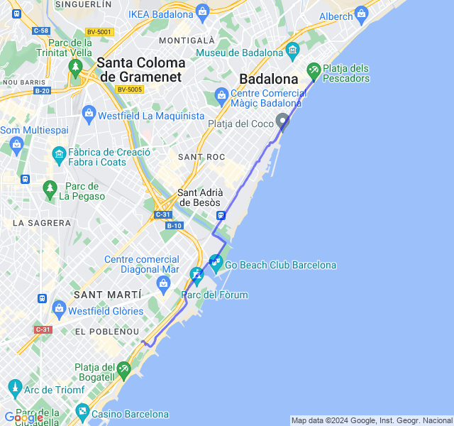



- 16km Z3 (VDOT 4:15/4:20).
Ultima uscita impegnativa prima della gara: da oggi tapering!
Già prima di uscire non avevo grandi sensazioni e infatti non è andata molto bene. Passo buono ma FC alla deriva fin da subito. Fino agli ultimi 2 km in Z4 ma solo di qualche battito (forse anche dovuto al gran caldo di oggi a cui non son abituato), poi in piena Z4.
Ovviamente per il morale non è il massimo un'ultima uscita così. Ora la questione è: a che passo si parte Domenica prossima? (se dovessi dirlo ora, partirei camminando 😞) E fino a che punto si tiene il passo senza rischiare di scoppiare??

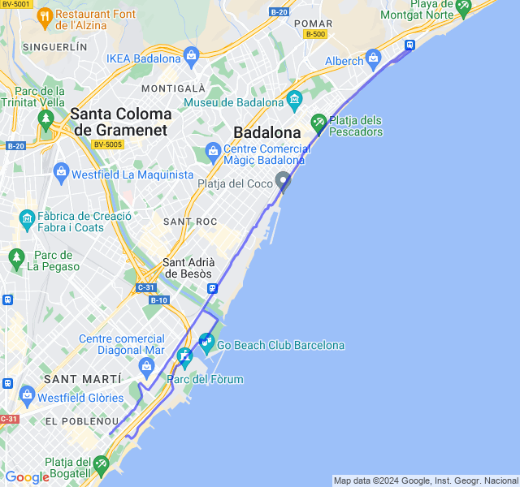



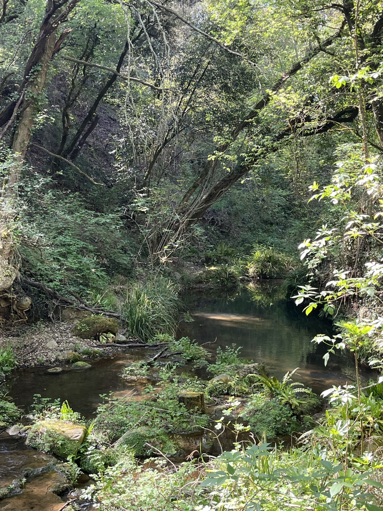

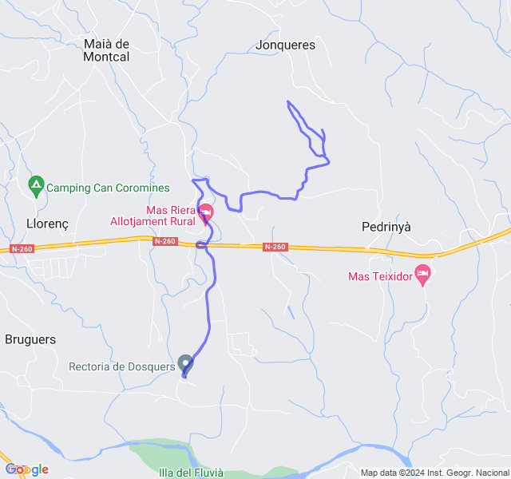



- 10km Z2. Inizio un po’ legnoso ma poi via via le gambe si sono sciolte. Direi un buon allenamento tranquillo.
Sono un paio di giorni però che ho un dolore all’arco plantare nella parte interna abbastanza vicino all’attacco delle dita. Mentre corro lo sento appena ma a riposo se piego le dita mi fa abbastanza male.

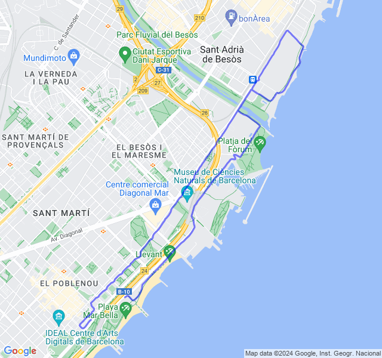



- 5x1000 Z3 (VDOT 4:15/4:20) rec 200m.
Andata abbastanza bene, non particolarmente brillante nonostante lo scarico.
Un po' di dolorini qui e là ma potrebbe anche essere l'ansia pre-gara

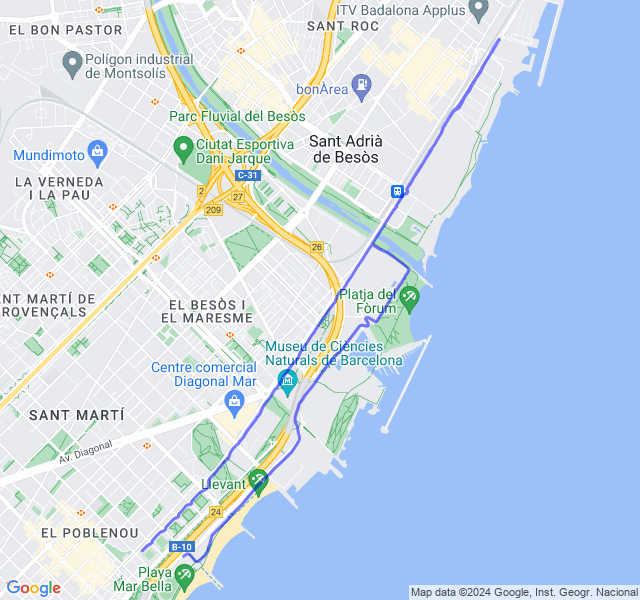



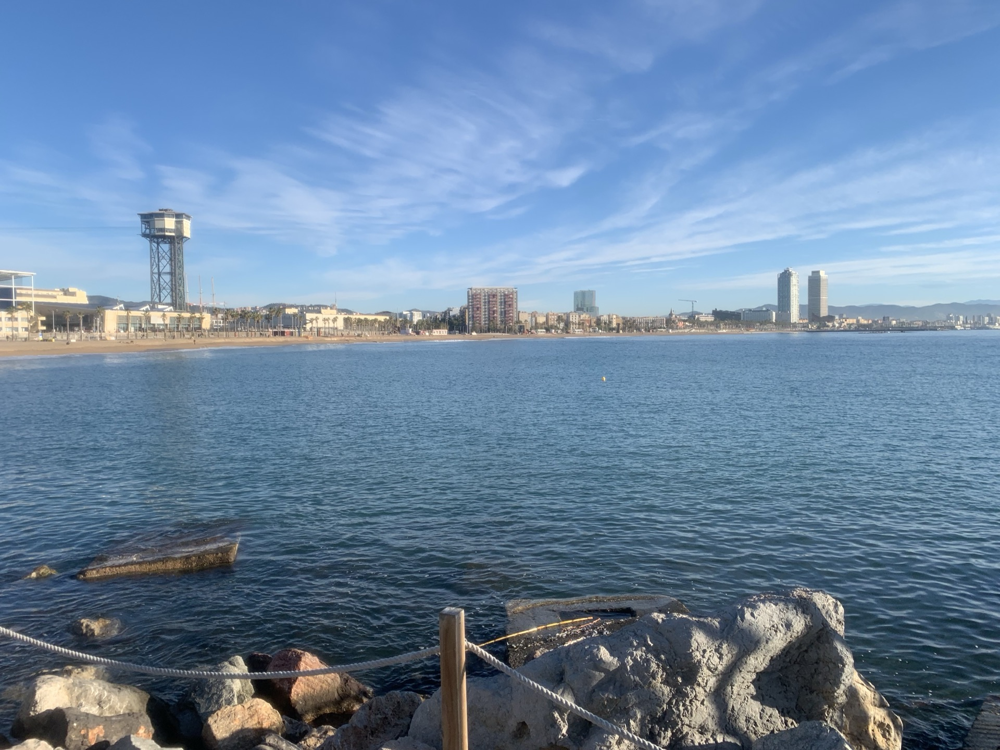

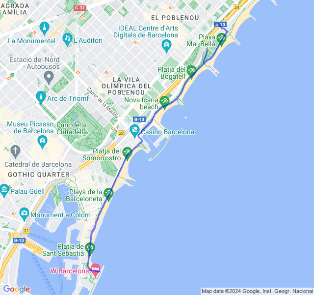


## Gara!

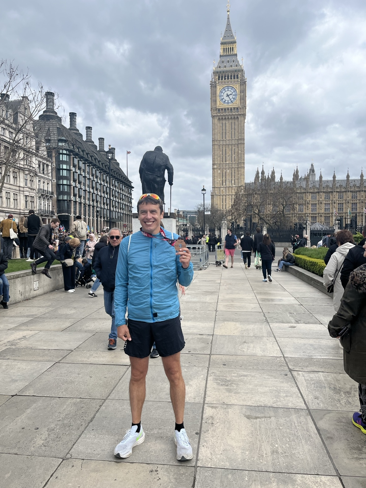

*TCS London marathon 2024!*
Obiettivo A della stagione centrato!

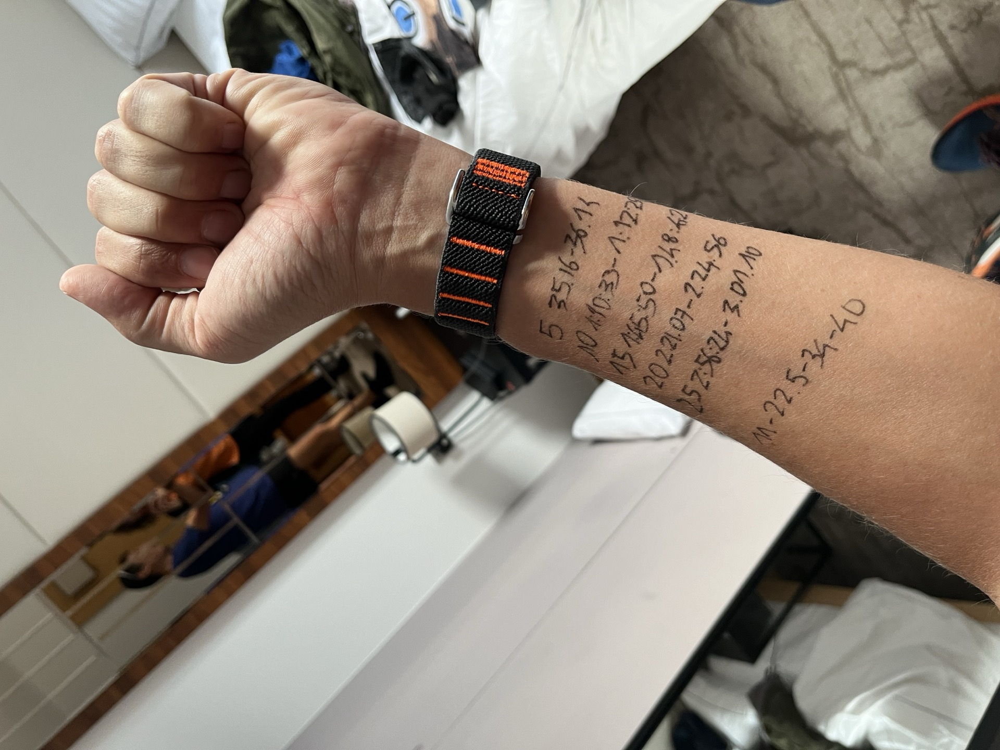

Quando ho iniziato a prepararla non avevo idea del tempo che avrei potuto fare ma volevo riuscire a fare una maratona spingendo fino alla fine e così è stato.

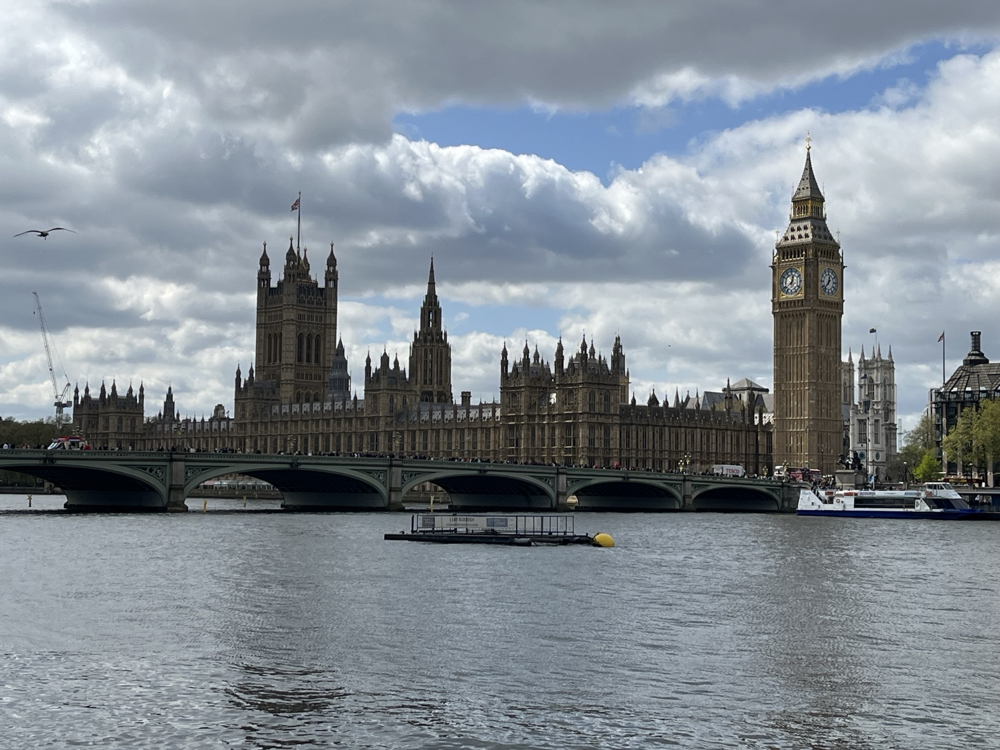

È venuto fuori anche un gran tempo, per me, che non pensavo di poter fare: 3:06:11; PB per oltre 13 minuti.
Qualche dolorino qui e là mi han fatto un po’ preoccupare all’inizio ma son scomparsi dopo pochi km.  Qualche accenno di crampo a quadricipite destro al 40esimo ma niente di che: tutto ottimo!

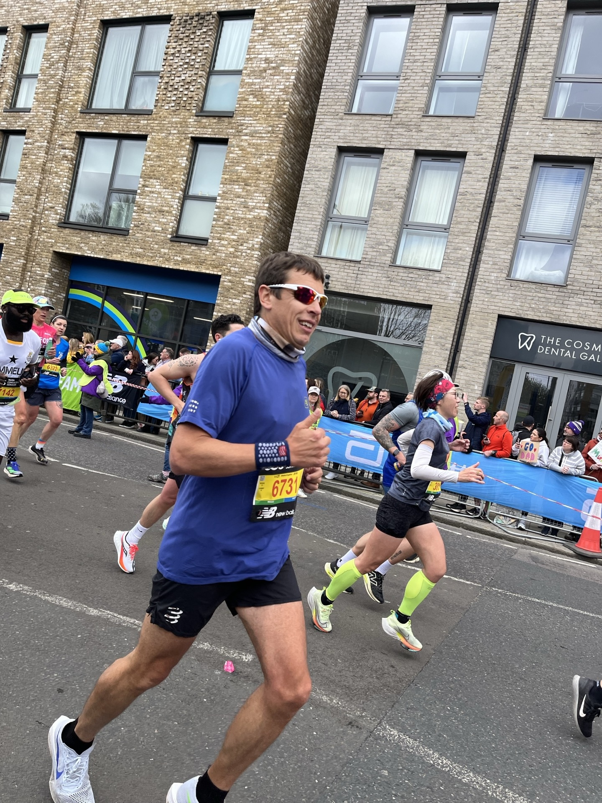

Son partito seguendo le indicazioni di Daniele a 4:25 e, cosa da non crede, a quel ritmo son stato fino alla mezza in Z2 cosa che in allenamento non mi è mai riuscita.
Tifo incredibile, non un minuto di silenzio. Persone in ogni dove!
Davvero una bellissima esperienza!

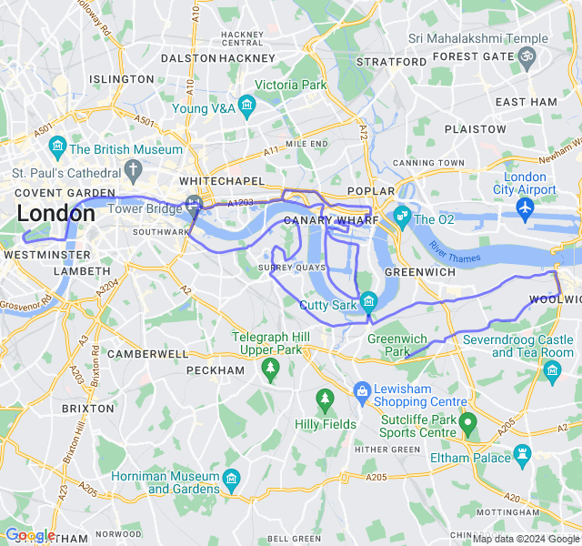


## Settimana post gara

- 10km Z1. Prima uscita dopo la gara, gambe un po' stanche ma pensavo peggio! Sono andato a sensazione più che controllando la FC.

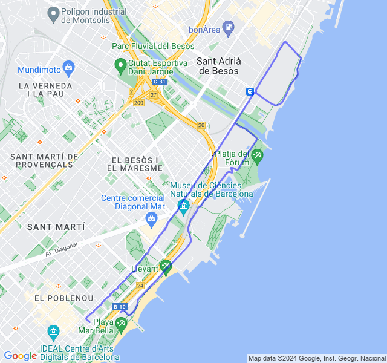



- 15km Z2. Dovevano essere 16 ma ho fatto male i conti e mi son trovato a casa un km prima.
Tutto tranquillo, fatti senza forzare anche se la FC è ancora un po' alta.

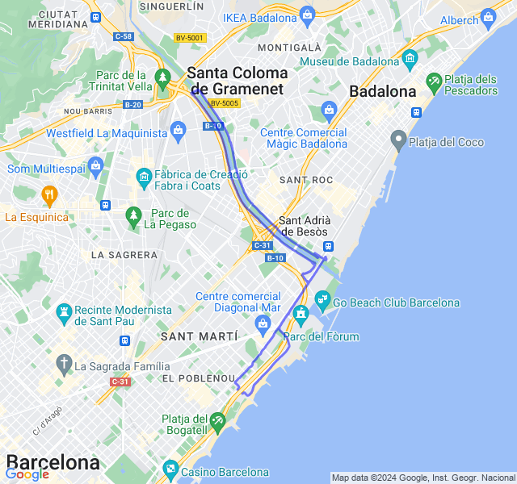



