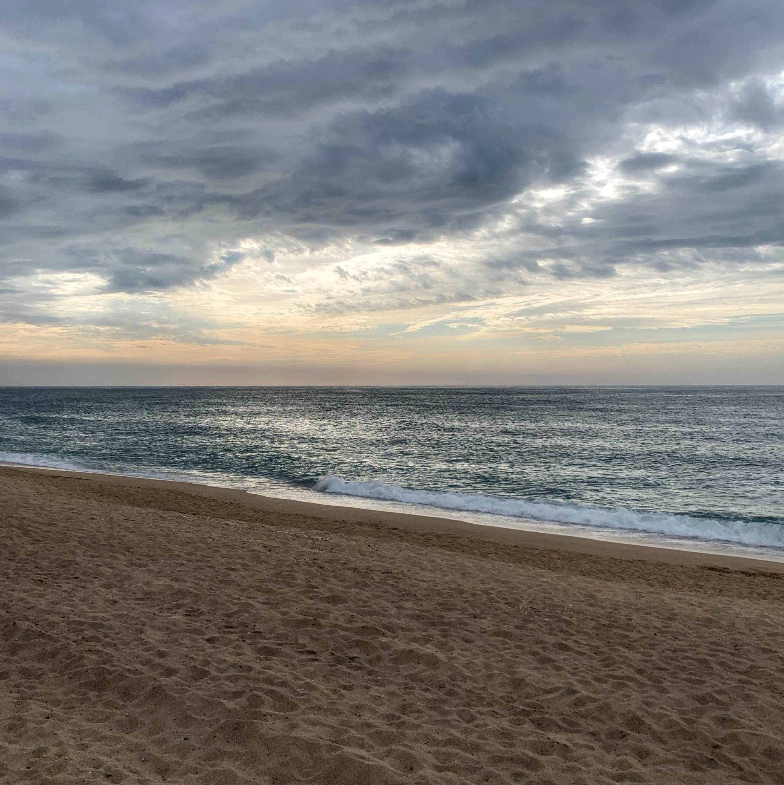
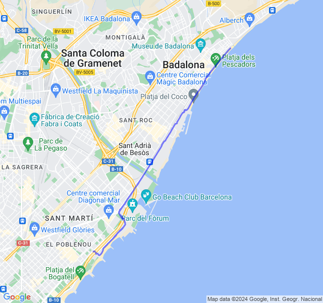
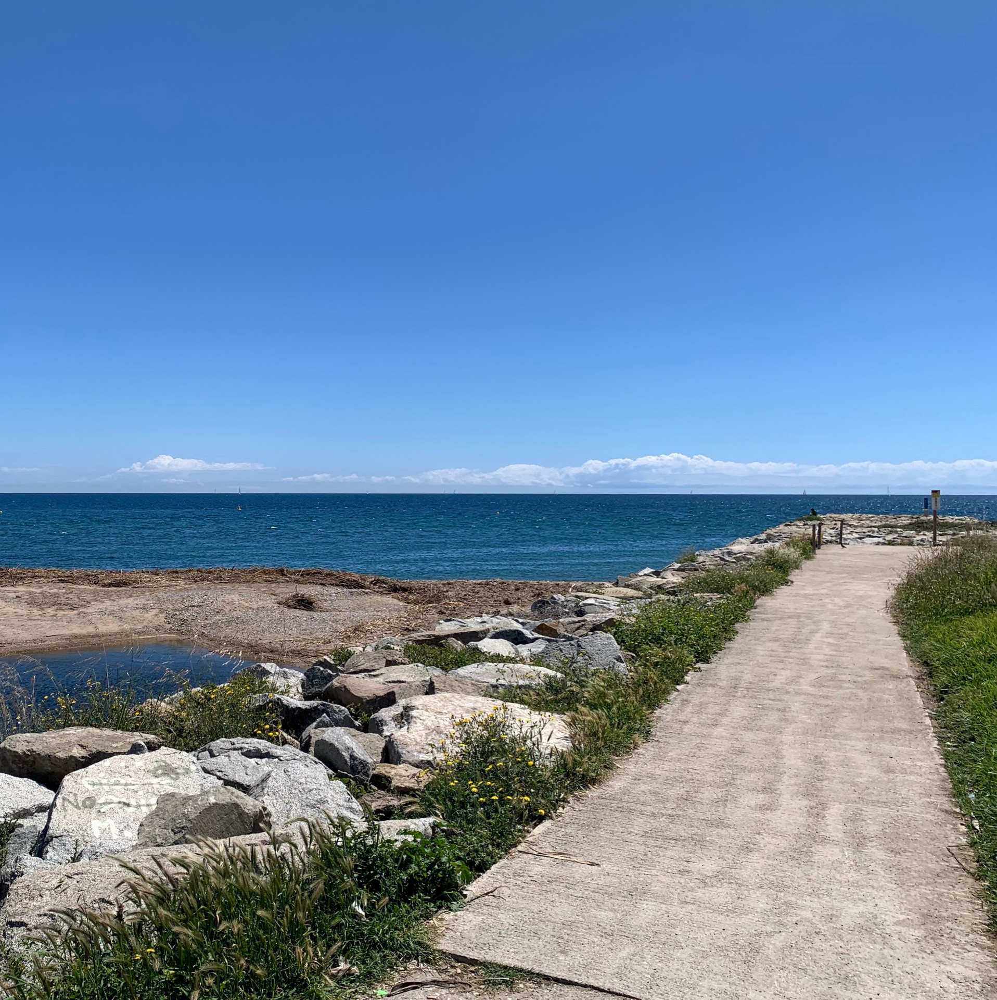
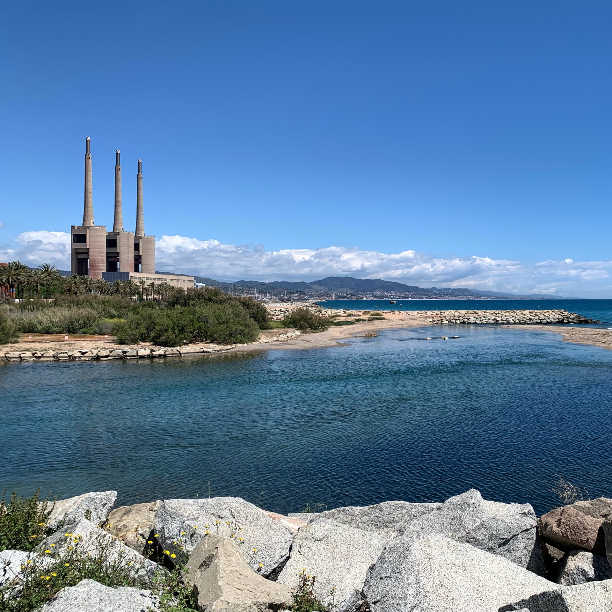
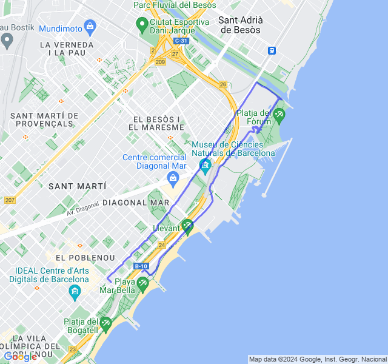
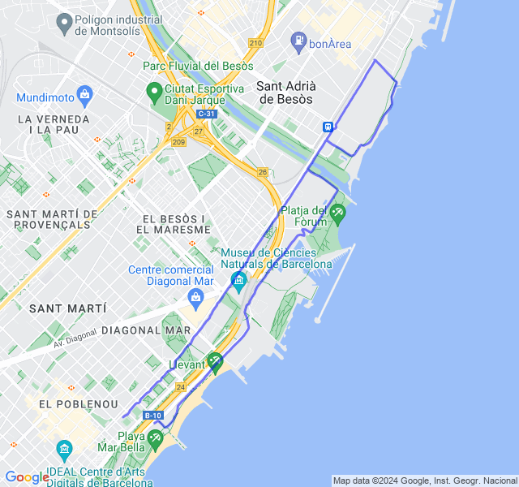
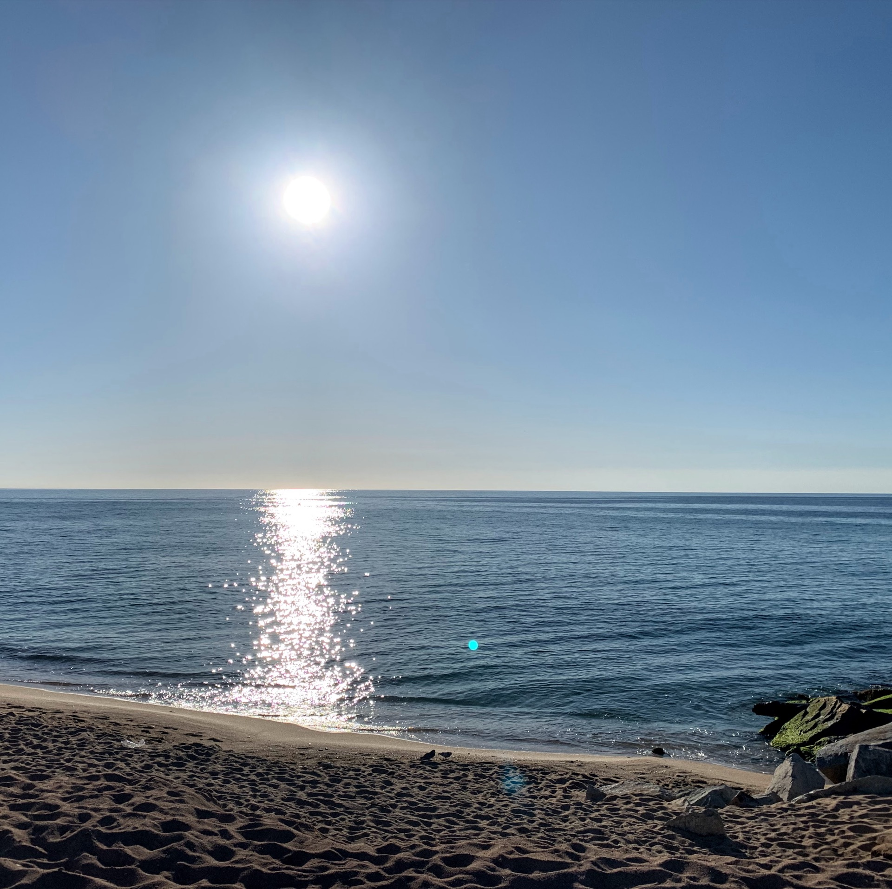
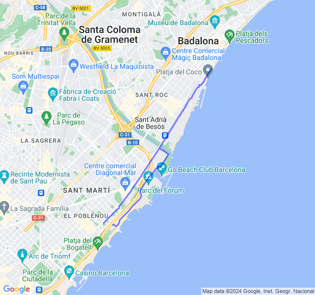
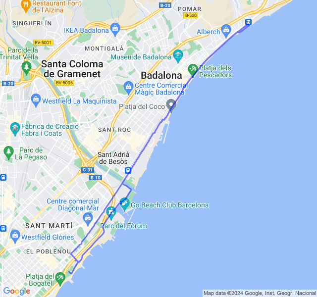

Riprendiamo il carico dopo il rallentamento post maratona!
<!--more--> 

## Prima uscita
14km Z1 + andature + allunghi.

Nuova tabella, nuova avventura!
Son riuscito a correre la mattina al posto della pausa pranzo ed è tutta un'altra cosa. 🥳

FC abbastanza buona e gambe OK.



## Seconda uscita
2x5x400 Z5 (VDOT 3:26) rec. da fermo.

Che bello tornare a fare un rosso dopo le gare! 
Le gambe girano abbastanza bene anche quando intravedo diversi santi a lato della strada che mi incitano... 👻



## Terza uscita
8/10km corsa lenta + potenziamento

Tutto tranquillo!



## Quarta uscita
12km Z2.

Oggi mi sentivo un po' stanco, soprattutto a inizio allenamento.

La ripresa dopo due settimane di quasi stop si fa sentire 😅



## Quinta uscita
4x1500 + 6x500 Z3

Oggi sensazioni abbastanza buone, forse solo gli ultimi 500 ero un po' stanco. La FC però è restata sempre troppo alta e anche durante le pause è scesa poco.

Speriamo che il weekend di riposo mi faccia recuperare un po'.


