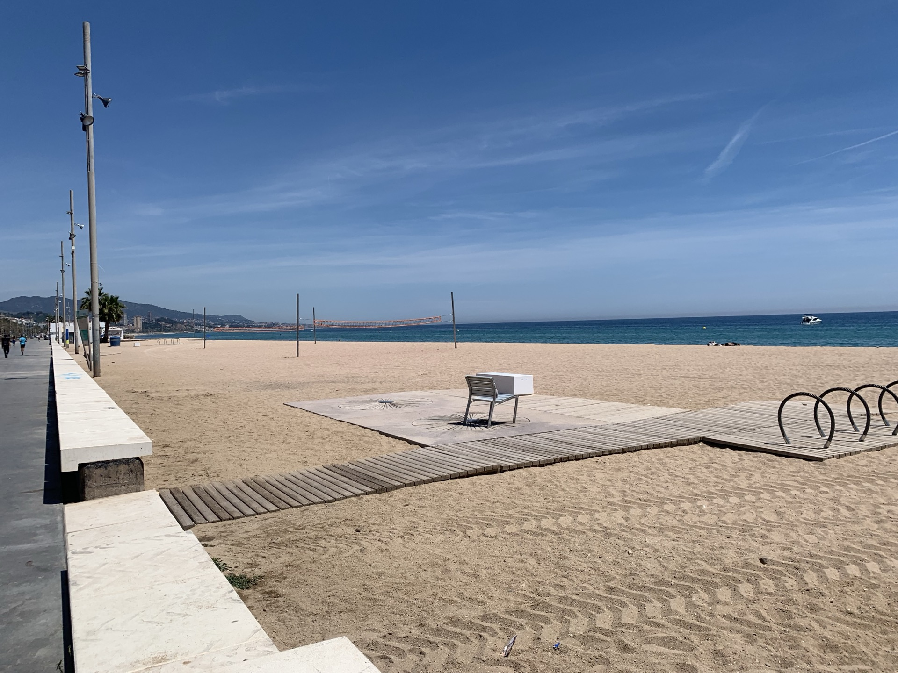
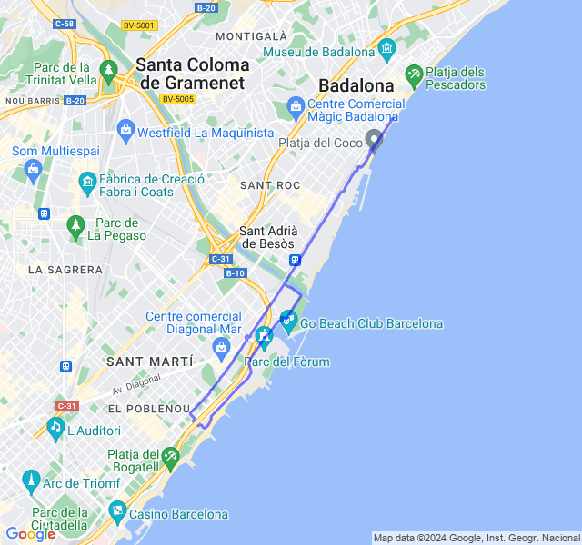
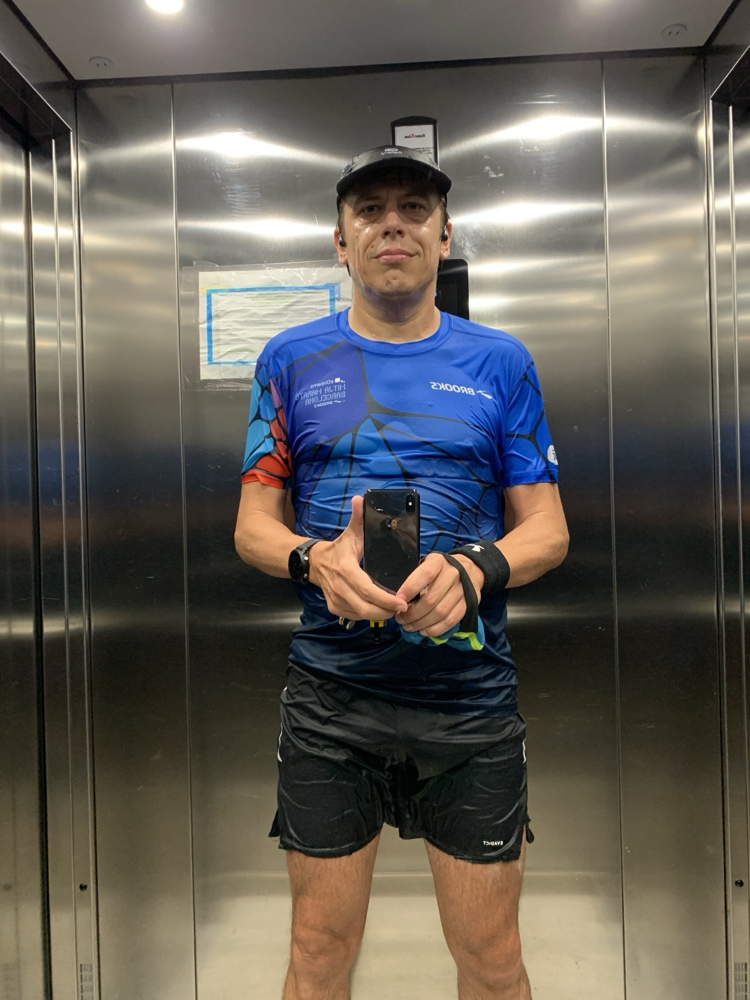
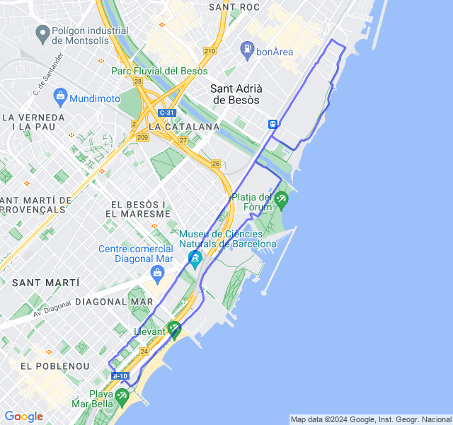
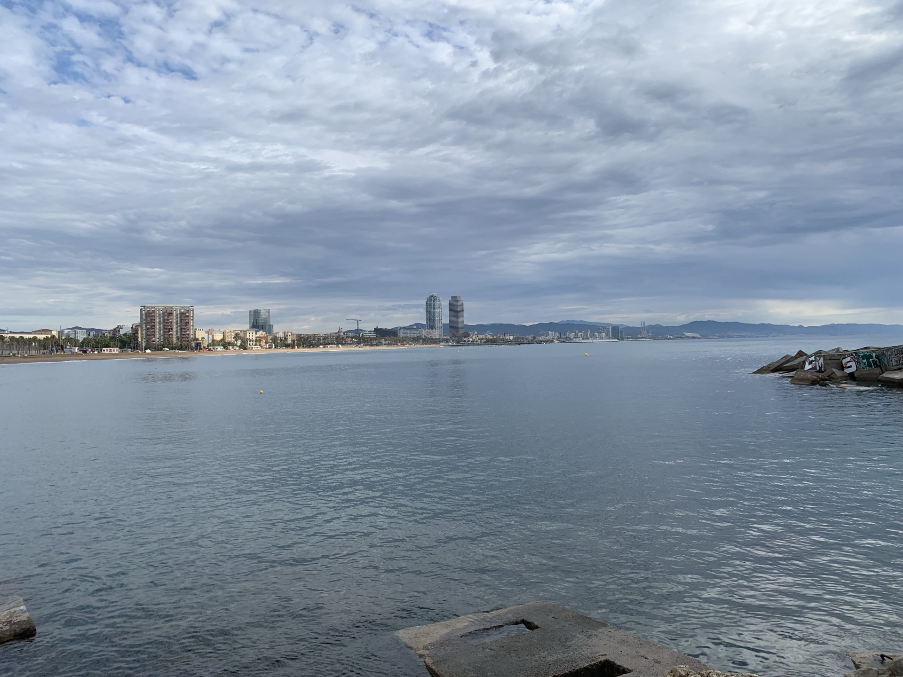
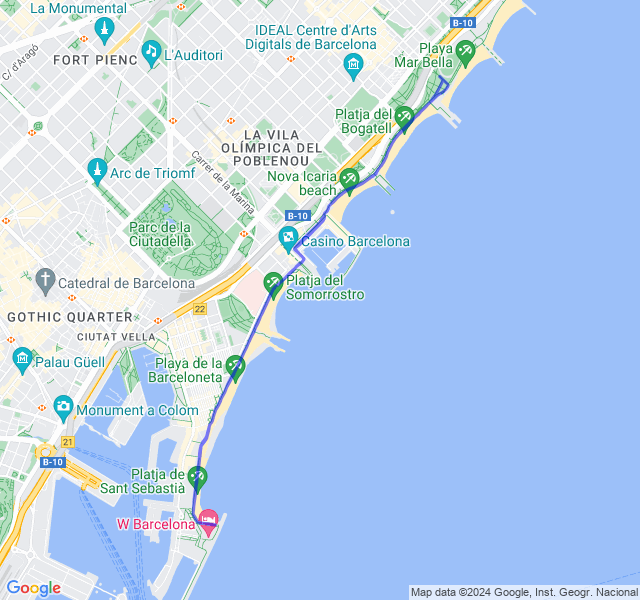
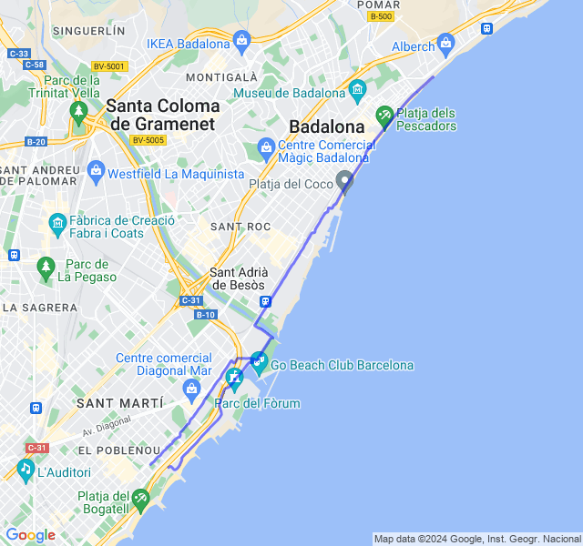
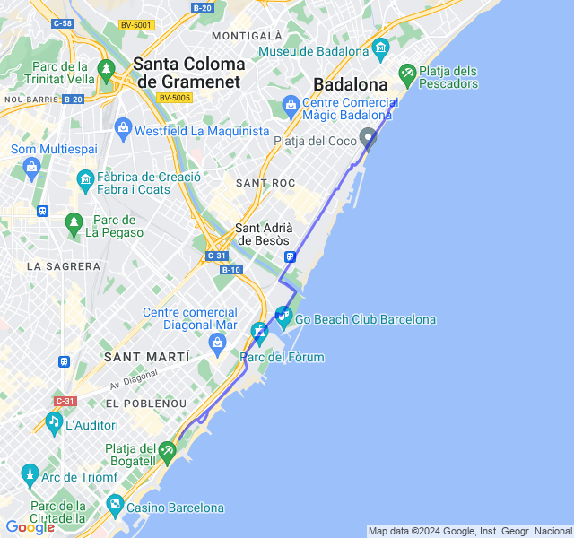

Ultima settimana di carico prima della Cursa Diagonal 10K

<!--more--> 

## Prima uscita
12km Z1 + andature + allunghi.

Abbastanza bene. Battiti altini ma non credo riuscirò a fare di meglio con le temperature che si alzano. 🥵



## Seconda uscita
2km Z4 + 5x200 Z5 + 3x1km Z4 + 5x200 Z5.

Rosso del martedì sotto il diluvio; *bello tosto*. L'avevo un po' sottovalutato, soprattutto la distanza.

Alla fine mi pare andato abbastanza bene: stanco ma non distrutto. 
Al coach saranno fischiate un po' le orecchie negli ultimi 5x200 con le scarpe zuppe d'acqua e le pozzanghere fino alle caviglie 😜!



## Terza uscita
8/10km corsa lenta.

Buona FC, tutto bene!



## Quarta uscita
10kmZ2.
Tutto tranquillo, gambe un po' stanche dal potenziamento di ieri.



## Quinta uscita
10 km Z3.

Un bel giallone; ho voluto provare a tenere ma Z3 VDOT ma la FC è stata alta, per la maggior parte in Z4 anche se solo di pochi battiti. Anche il caldo ha influito come al solito visto che ho dovuto correre in pausa pranzo.

Fortunatamente la gara di domenica sarà la mattina!


