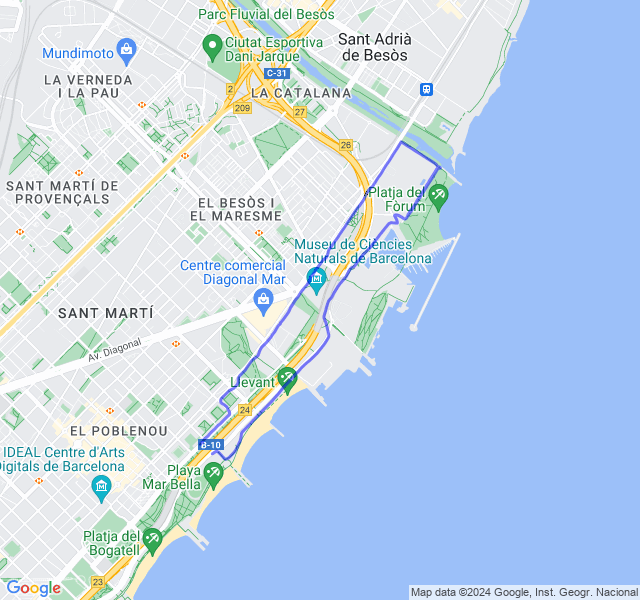
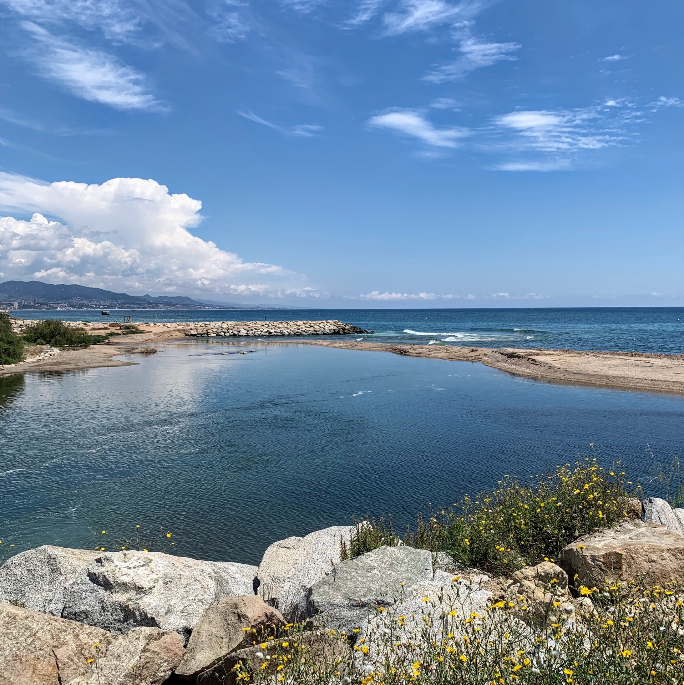
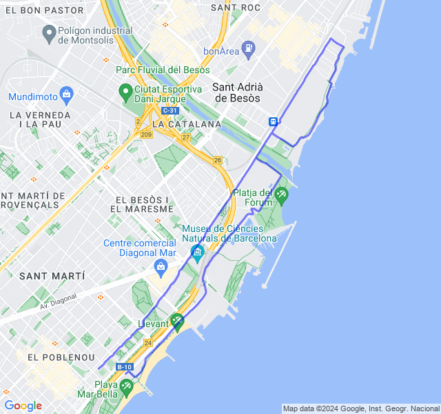
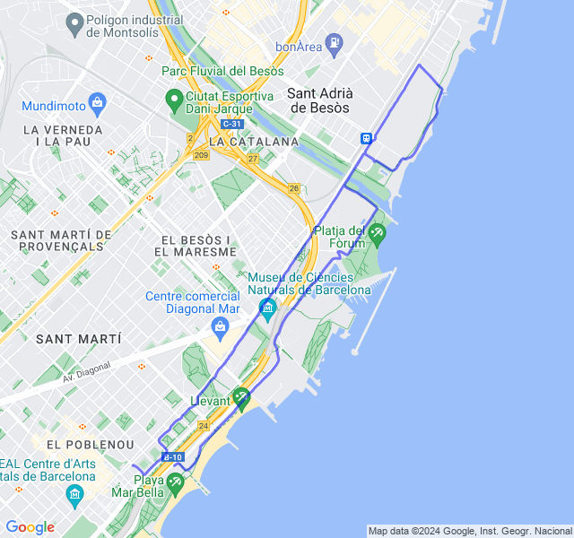
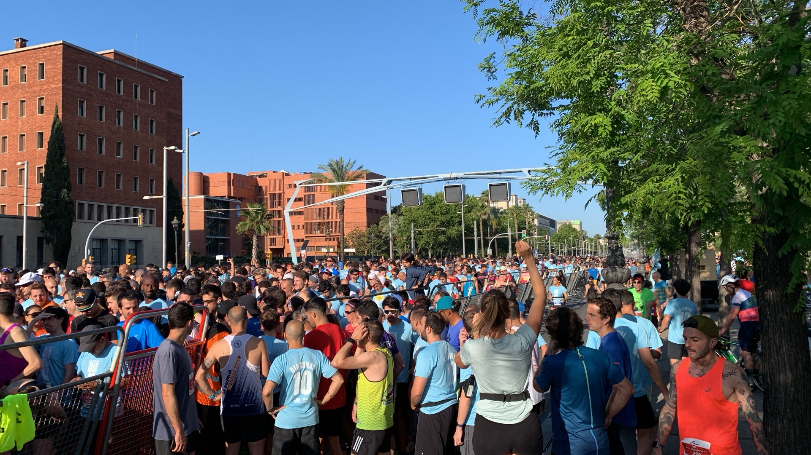
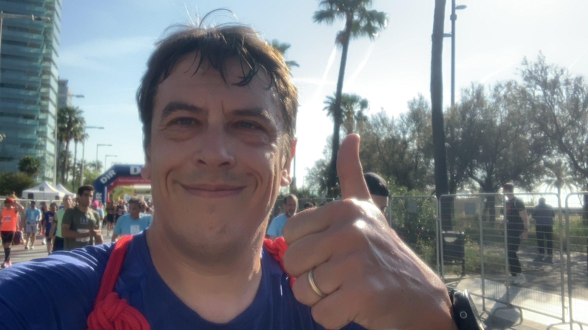
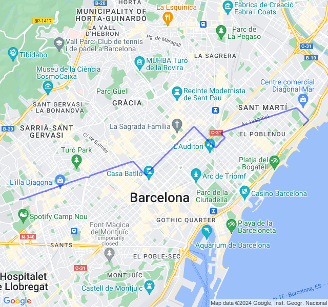

Cursa Diagonal!

<!--more-->

## Prima uscita
10x200 Z5. Saltato il lento di ieri, la settimana parte direttamente con un rosso.
Abbastanza bene la parte veloce, la parte lenta poco costante.
🏃🏻‍♂️



## Seconda uscita
10km Z1. Una buona Z1 col fresco del mattino.

Ho saltato gli allunghi per mancanza di tempo 😞



## Terza uscita
8km Z1 + allunghi.
Ultima uscita prima della 10 km di domenica tutto tranquillo.



## Quarta uscita

10km Cursa Diagonal.

La giornata non è iniziata nel migliore dei modi: son arrivato tardi e i camion per lasciare le sacche erano già partiti, in più avevo pochissimo tempo per il riscaldamento. Ho fatto giusto 400m di corsetta e 2 allunghi e poi via, con lo zaino in spalla! 😟

Non ci speravo proprio visto i presupposti ma alla fine la gara è andata benone; ho sofferto un po' gli ultimi 2 km ma ci sta tutto!
Ora è ufficiale, nel 2024 ho fatto il mio PB su tutte le distanze dei 10k alla maratona dopo 15 anni di gare! 🥳


